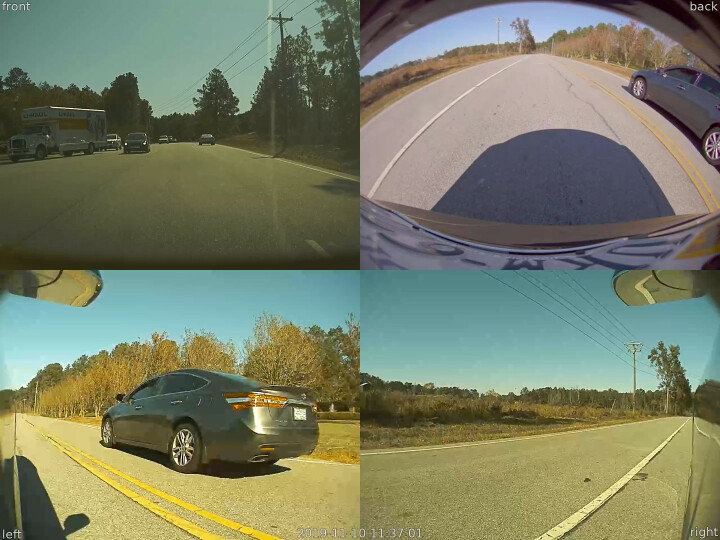

# teslacam-merge

Combine TeslaCam videos into a single output video.  Allows you to set
the output video size, and add a title to the output video.



Features:
* Uses [ffmpeg][] to combine output videos.
* Scale results.
* Automatically sorts input videos, and handles missing videos.
* Extracts timestamp from video file names.

Example:
```
# combine given videos, set the title to "sample video", and write the
# result to the file "sentry-example.mp4"
teslacam-merge -t 'sample video' -s 320x240 -o sentry-example.mp4 \
  2019-11-08_01-55-17-* 2019-11-08_01-48-14-{left,right}*.mp4
```

## Installation

Install `teslacam-merge` via [RubyGems][]:

```
gem install teslacam-merge
```

## Presets
Valid values for the `--preset` option:

* `full`: output size: 2560x1920, font size: 32
* `large`: output size: 1920x1440, font size: 32
* `medium`: output size: 1440x1080, font size: 24
* `half`: output size: 1280x960, font size: 18
* `small`: output size: 640x480, font size: 16

  [rubygems]: https://rubygems.org/
  [ffmpeg]: https://ffmpeg.org/
